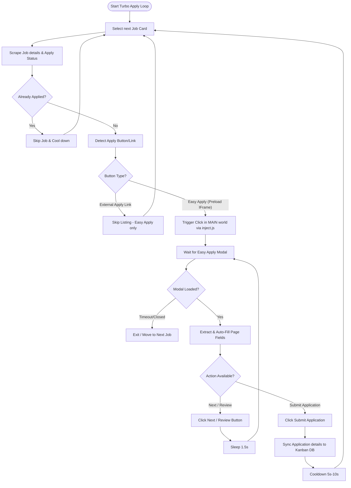

# LinkedIn Connector Simulation & Automation

This directory contains the LinkedIn integration connector for the AI Job Apply Assistant extension. It also contains monitoring and automation scripts to test and run the integration.

## Files
*   `index.js`: The connector implementation, containing DOM selectors, details scraping, and step-by-step form-filling auto-fill logic.
*   `monitor.js`: Playwright-based test script that opens a headless or headed browser session, logs in to the dashboard, and monitors the LinkedIn application modal, taking steps snapshots.
*   `turbo_apply.js`: Script to automatically click and toggle Turbo Mode on the active LinkedIn tab.

---

## Technical Architecture & Improvements

### Iframe-Safe Traversal
LinkedIn renders job descriptions, easy-apply buttons, and modal dialogs inside same-origin `<iframe>` elements (usually `https://www.linkedin.com/preload/?_bprMode=vanilla`). 

To bypass extension frame sandbox isolation without injecting code into nested frames, the connector implements:
1. **Frame-Aware Selectors**: Overrides standard `document.querySelector` and `document.querySelectorAll` with helper methods (`window.Connectors.LinkedIn.querySelector`) that traverse accessible same-origin subframes recursively.
2. **Contextual DOM Execution**: Performs all input modifications, clicks, and element validation relative to the modal's `ownerDocument` instead of the global `document`.
3. **Cross-World Trigger Interceptor**: Updated [inject.js](file:///Users/sandeepkumar/github/job-apply-ai/browser-extension/inject.js) in the page's `MAIN` world to programmatically dispatch click/mouse events within child iframes.

---

## Scenario Decision Flow

The state machine below illustrates the different scenarios and flows handled by the connector:



---

## Running the Simulation

### Prerequisites
1. Ensure the backend database and API server are running (`docker-compose up`).
2. Make sure you have Playwright installed:
   ```bash
   npm install playwright
   ```

### 1. Running the Monitor / Simulation
The monitor script launches a Google Chrome browser with the extension loaded, navigates to LinkedIn, and prompts you to log in. Once logged in and on the search page, press Enter in your terminal to start the automated loop:
```bash
node browser-extension/connectors/linkedin/monitor.js
```
Interactive commands inside the terminal:
*   `c` / Enter: Capture the current DOM state, field mappings, and save a screenshot.
*   `q` / `exit`: Quit the monitor session and close Chrome.

### 2. Launching Turbo Apply Automatically
To automatically click through the dashboard and launch Turbo Apply on an active Chrome session, run:
```bash
node browser-extension/connectors/linkedin/turbo_apply.js
```
This script connects to the remote Chrome debugger (port `9222`), synchronizes credentials via the localhost dashboard, opens the AI Job Apply drawer on the active LinkedIn tab, switches to the Turbo Mode tab, and starts the automation loop.
